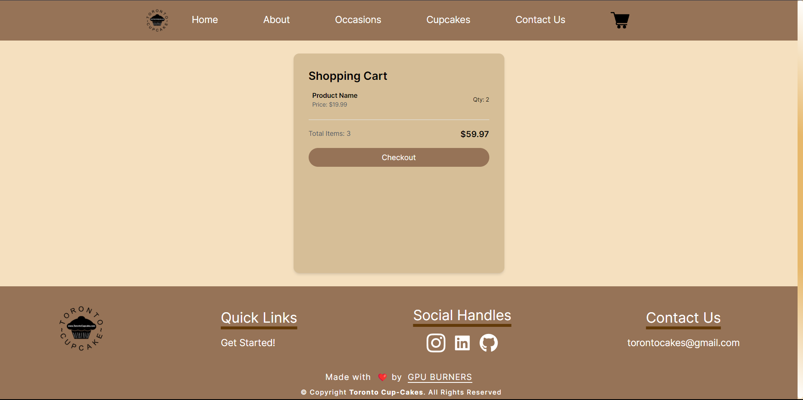

  

<h1 align="center">

  

### **Welcome to the Toronto CupCake Website repository!**
This project has been created to apply UI principles to an existing website as part of the Skill Competency Evaluation for Human-Computer Interaction.  
The goal is to redesign the original website [Toronto Cupcakes](https://www.torontocupcake.com/) and replicate its features within this repository.

### **Techstack Used**
- React + NextJS
- SwiperJS
- Tailwind CSS

<!-- #### **Visit the site : https://gfgviit.tech/** -->
### **Snips**
## Home

## About

## Occasions

## Cupcakes

## Contact Us

## Cart

## ✍️ Contributors

- [@AryanPatil](https://www.github.com/AryanP45)
- [@AdinathShelke](https://www.github.com/adi-shelke)
- [@BhagyashreeTekade](https://github.com/bhagyashreetekade)

## 🏆 License

Distributed under the MIT License. See `LICENSE` for more information.
